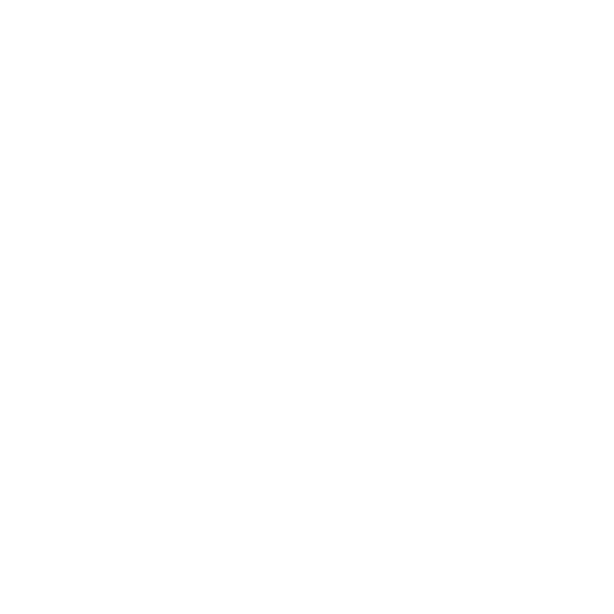

### 

 

    
     
     
    

	    <h1><b>Krypton - A Classroom Manager</b></h1> 
    

## About
<u>Krypton</u> is a Discord Bot that can be used by educational institutions revolving alround Discord to fulfill their purpose. 

## Features
1. Creating classes within channel.
2. Enrolling students in the class.
3. Creating assignments for the class. 
4. Submitting assignment and tracking them.

If the feature you are thinking is not in the list, be free to create a new Issue [here](https://github.com/suyash-chavan/krypton/issues).

## Note
Make sure you have **Teacher** role on the server and given only to teachers.

## Special Thanks

 

 
 

This project is being done for **[HarperDB](https://harperdb.io/) Hackathon** and maintained for long period even after Hackathon. Their flexible and fast database is so cool and APIs are well documented.

## Contributing
Please read [CONTRIBUTING.md](https://github.com/suyash-chavan/krypton/blob/main/COUNTRIBUTING.md) for details on our code of conduct, and the process for submitting pull requests to us.

## License

This project is licensed under the MIT License - see the [LICENSE](https://github.com/suyash-chavan/krypton/blob/main/LICENSE) file for details

